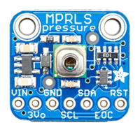
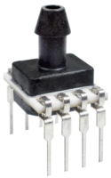
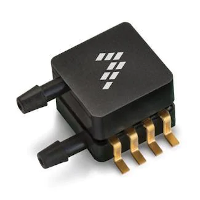
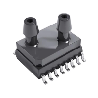

# Capteurs de pression 3,3 V

## Trois types de mesure de pression

* pression **absolue** : valeur mesurée par rapport au vide.
* pression **manométrique** ou relative (type jauge) : mesure par rapport à la pression atmosphérique.
* pression **différentielle** : valeur entre deux pressions.

## Capteurs de pression absolue

### Analogique

### I2C

#### Adafruit MPRLS (3 à 5 V)

* Fabricant : Adafruit
* Capteur : Honeywell MPRLS0025PA00001A (calibré et compensé)
* Pression de fonctionnement : 0  à 25 PSI (0 à 170 kPa)
* Précision : 1,5% (10% à 90% de 25 PSI)
* Diamètre tube : 2,5 mm
* Résolution :  24 bit
* Adresse : 0x18
* Tension d'alimentation de fonctionnement : 3,3 VDC (3 à 5 V) 
* Prix approximatif :  16,80 € ([Lextronic](https://www.lextronic.fr/module-capteur-de-pressions-mprls-40627.html))

#### HSCDANN030PA2A3 (3,3 V)

* Fabricant : Honeywell
* Pression de fonctionnement : 0  à 30 PSI (0 à 200 kPa)
* Précision : 1%  (10% à 90% de 30 PSI)
* Diamètre tube : 4,93 mm
* Résolution : 14 bit
* Package/Boîte : DIP-8
* Tension d'alimentation de fonctionnement : 3,3 VDC (3 à 3.6 V) 
* Prix approximatif : 32 € ([Mouser](https://eu.mouser.com/ProductDetail/Honeywell/HSCDANN030PA2A3?qs=pcUO8jIlt0a2xNetHRJOJw%3D%3D))

## Capteurs de pression différentielle

### Analogique

#### MP3V5004DP (3 V)

* Fabricant: NXP
* Pression de fonctionnement : 0 kPa à 3,92 kPa (400 mm H20)
* Précision : 1.5 %, 2.5 %
* Diamètre tube : 3,3 mm
* Tension de sortie : 0.6 V à 3 V
* Boîtier : case 1351-01 (pas 2.54 mm)
* Tension d'alimentation de fonctionnement : 3 VDC (2,7 à 3,3 V)
* Prix approximatif : 12 € ([Mouser](https://eu.mouser.com/ProductDetail/nxp/mp3v5004dp/?qs=3b6%2Fl7XffK%2FxZ9yD68Y6nw%3D%3D&countrycode=DE&currencycode=EUR))

### I2C

#### SM9541

* Fabriquant : SMI
* Pression de fonctionnement : 0 à 3,92 kPa (40 cm H2O)
* Précision : 1 %
* Diamètre tube : 3 mm
* Résolution : 14 bit
* Boîtier : SOIC-16 (pas 1,27 mm)
* Tension d’alimentation : 3 à 3,6 VDC
* Prix approximatif : 20 € ([Mouser](https://eu.mouser.com/ProductDetail/Silicon-Microstructures-Inc/SM9541-040C-D-C-3-S?qs=emHYq6U3k7K%252BUZWdl6JjEQ==))