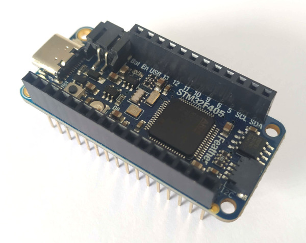
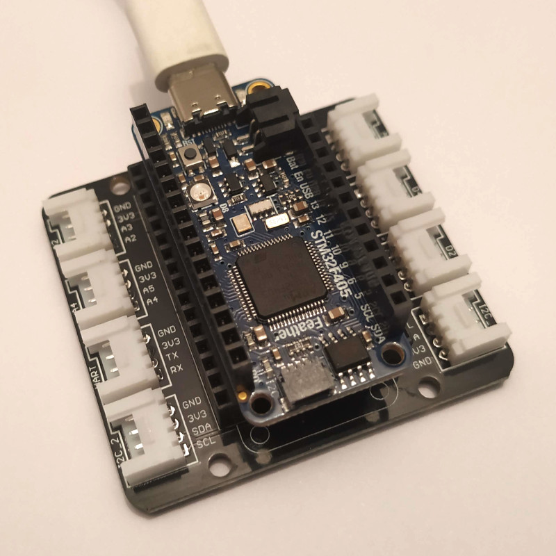

# STM32F405 Feather Express





## Firmware MicroPython

[https://learn.adafruit.com/adafruit-stm32f405-feather-express/micropython-setup](https://learn.adafruit.com/adafruit-stm32f405-feather-express/micropython-setup)

## Connexion au REPL

```python
MicroPython v1.11-387-ga069340c1-dirty on 2019-10-03; Feather STM32F405 with STM32F405RG
Type "help()" for more information.
>>> 
```

## Utilisation

Les fonctions sont les mêmes que pour le Pyboard officielle :

[http://docs.micropython.org/en/latest/pyboard/quickref.html](http://docs.micropython.org/en/latest/pyboard/quickref.html)

### Nom des broches

Pour connaître le nom des broches :

```python
>>> from pyb import Pin
>>> dir(Pin.board)
['__class__', '__name__', 'A0', 'A1', 'A2', 'A3', 'A4', 'A5', 'BATTERY_MONITOR', 'BOOT1', 'D0', 'D1', 'D10', 'D11', 'D12', 'D13', 'D5', 'D6', 'D8', 'D9', 'FLASH_CS', 'FLASH_MISO', 'FLASH_MOSI', 'FLASH_SCK', 'MISO', 'MOSI', 'NC_A0', 'NC_A1', 'NC_A2', 'NEOPIXEL', 'RX', 'SCK', 'SCL', 'SDA', 'SD_CK', 'SD_CMD', 'SD_D0', 'SD_D1', 'SD_D2', 'SD_D3', 'SD_DETECT', 'SWCLK', 'SWDIO', 'TX', 'USB_DM', 'USB_DP', 'USB_ID', 'USB_VBUS']
```


* Entrées/sorties digitales de `"D0"`  à  `"D1" `  et `“D5"`  à `"D13"`.
* Entrées analogiques  de `"A0"`  à `"A5"`.

### Led utilisateur

La carte possède une led utilisateur de couleur rouge (LED1).

```python
>>> from pyb import LED
>>> led = LED(1)  # Déclaration de la Led
>>> led.on()      # Allume la Led
>>> led.off()     # Etteint la Led
>>> led.toggle()  # Change l'état de la Led
```

### Sorties digitales

```python
>>> from pyb import Pin
>>> pin = Pin('D11', Pin.OUT_PP) # Pin.OUT_PP pour sortie "classique" (push-pull)
>>> pin.on()                    # Etat haut
>>> pin.off()                   # Etat bas
```

### Entrées digitales

Lecture de niveau logique :

```python
>>> from pyb import Pin
>>> pin = Pin('D11', Pin.IN)        # Pin en entrée "classique"
>>> pin.value()                     # Lecture état
```

Activer la résistance interne de tirage vers le haut (ex. bouton poussoir) :

```python
>>> from pyb import Pin
>>> pin = Pin('D11', Pin.IN, Pin.PULL_UP)  # Pin en entrée avec tirage vers le haut
>>> pin.value()                           # Lecture état
```

### Entrées analogiques (12 bits)

``` python
>>> from pyb import Pin, ADC
>>> adc = ADC(Pin("A0"))     # Déclaration de l'ADC sur la broche A0
>>> adc.read()               # Lecture de la conversion de 0 à 4095 (12 bits)
```

Affichage de la valeur de la tension en volt :

```python
from pyb import Pin, ADC

adc = ADC(Pin("A0")) # Déclaration de l'ADC sur la broche A0

Vcc = 3.288          # Valeur de la tension d'alimentation (3.3 V)
N = adc.read()       # Lecture de la conversion de 0 à 4095 (12 bits)
U = N/4095*Vcc       # Calcul de la tension
print(N, U)          # Affichage
```

Pour plus de précision, la tension Vcc a été mesurée au voltmètre.

### Port I2C

Bien que la librairie `pyb` dispose d’une classe I2C, il est préférable d’utiliser celle de la librairie `machine` qui est compatible avec toutes les cartes fonctionnant sous MycroPython.

#### I2C matériel

Le port I2C est présent sur les broches SCL et SDA.

```python
>>> from machine import I2C 
>>> i2c = I2C(1)    # Port I2C sur SCL et SDA
>>> i2c.scan()      # Recherche de périphériques
```

#### I2C logiciel

Il est possible mettre en oeuvre un bus I2C logiciel à partir de deux broches digitales quelconques.

```python
>>> from machine import I2C 
>>> i2c = I2C(scl="D5", sda="D6")   # Port I2C logiciel sur D5 et D6
>>> i2c.scan()                      # Recherche de périphériques
```


#### Afficheur [GROVE I2C LCD V1.0](https://wiki.seeedstudio.com/Grove-16x2_LCD_Series/) 

Attention, la version RGB n’est pas compatible 3,3 V !

Copier la librairie `grove_lcd.py` (disponicle [ici](../lib/grove_i2c_lcd/grove_lcd.py)) dans  la mémoire flash de la carte avant d’éxécuter le programme.

```python
from machine import I2C
from grove_lcd import Lcd    # Librairie pour Grove I2C LCD V1.0

i2c = I2C(1)           # Port I2C sur SCL et SDA
lcd = Lcd(i2c,16,2)    # Afficheur LCD 16x2

lcd.clear()            # Efface l'écran
lcd.print("Bonjour")   # Ecrit un texte à l'emplacement du curseur
lcd.setCursor(0,1)     # Déplace le curseur
lcd.print("Feather")   # Ecrit un texte à l'emplacement du curseur
```

Ne pas oublier de copier la librairie `grove_lcd.py` (voir répertoire `i2c`) dans  la mémoire flash de la carte  à côté des fichiers `boot.py` et `main.py` .