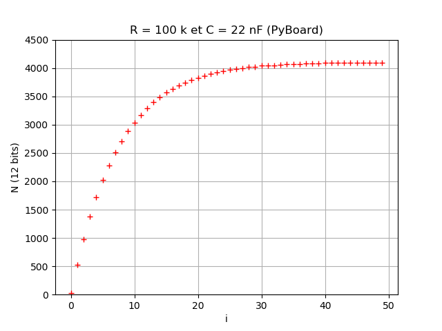
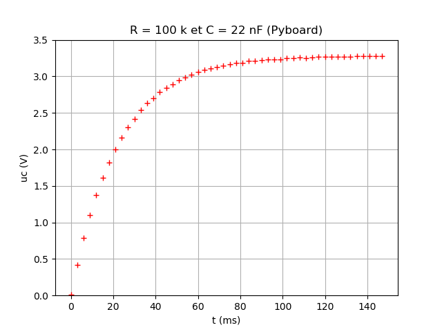
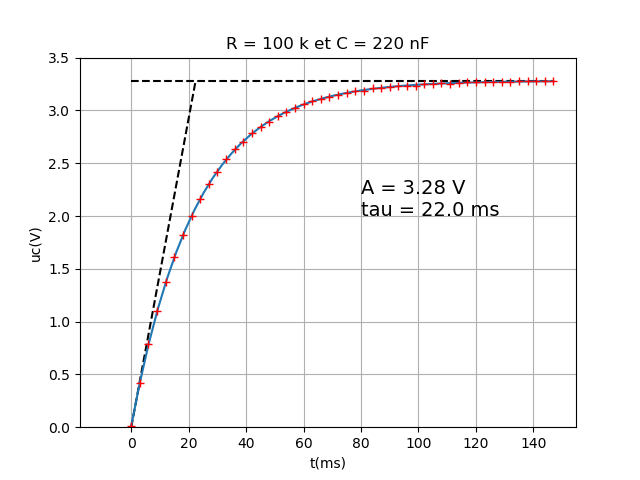

# Etude de la charge d'un condensateur à travers une résistance

## Principe

Le circuit RC est alimenté par la broche X1 (sortie digitale).

La broche X2 (CAN 12 bits) mesure la tension du condensateur.

L'échantillonnage des mesures se fait sans problème avec une période de 1 ms.

## Lecture directe sur le CAN

Programme MicroPython pour PyBoard :

```python hl_lines="1 3"
from pyb import Pin, ADC
from time import sleep_ms

x = []
y = []

pinX1 = Pin('X1', Pin.OUT)   # Alimentation du circuit RC
pinX2  = Pin('X2')           # Tension condensateur
adc = ADC(pinX2)             # Activation du CAN

pinX1.low()                  # Décharge du condensateur
sleep_ms(2000)               # Attendre 2 s

pinX1.high()                 # Début de la charge

for i in range(50):          # Mesures
    x.append(i)
    y.append(adc.read())
    sleep_ms(3)

# Affichage des mesures en CSV
print("i;N")                 # Variables
print("_;_")                 # Unités
for i in x :
    print(x[i], ";", y[i])   # Mesures
```





## Avec le temps et la tension

Programme MicroPython pour PyBoard :

```python hl_lines="1 3"
from pyb import Pin, ADC
from time import sleep_ms, ticks_ms, ticks_diff

x = []
y = []
nbPoints = 50               # Nombre de points de mesure

Vcc = 3.276
pinX1 = Pin('X1', Pin.OUT)  # Alimentation du circuit RC
pinX2  = Pin('X2')          # Tension condensateur
adc = ADC(pinX2)            # Activation du CAN


pinX1.low()                 # Décharge du condensateur
sleep_ms(2000)              # Attendre 2 s


start = ticks_ms()          # temps initial
pinX1.high()                # Début de la charge

# Mesures
for i in range(nbPoints):
    x.append(ticks_diff(ticks_ms(), start)) # Temps
    y.append(adc.read()*Vcc/4095)           # tension
    sleep_ms(3)                             # Temporisation

# Affichage des mesures en CSV
print("t;uc")                 # Variables
print("ms;V")                 # Unités
for i in range(nbPoints) :
    print(x[i], ";", y[i])    # Mesures
```



## Avec la modélisation

Programme de tracé à partir de Python sur un ordinateur.

```python hl_lines="1 3"
import matplotlib.pyplot as plt      
import numpy as np
from scipy.optimize import curve_fit

t,u = np.loadtxt('data2.txt',delimiter=';',skiprows=2,unpack=True)

def expo(x,A,tau,xo):                              # Définition de la fonction
    return A*(1-np.exp(-(x-xo)/tau))               # Expression du modèle


(A,tau,xo), pcov = curve_fit(expo,t,u,p0=[3,22,0]) # Determination des paramètres du modèle

print("A = ",A)                                    # Affichage de A
print("tau = ",tau)                                # Affichage de tau
print("xo = ", xo)                                 # Decalage  temporel

texte = "A = " + str(round(A,2)) + " V\n" + "tau = " + str(round(tau,0)) + " ms" 

tnew = np.linspace(-10,t.max(),50)
unew = expo(tnew,A,tau,xo)

# Tracé de la courbe
plt.plot([0,tau],[0,A],'k',linestyle='dashed')     # Tangente à l'origine
plt.plot([0,max(t)],[A,A],'k', linestyle='dashed') # Asymptote à l'infini
plt.plot(tnew,unew)
plt.plot(t,u,'r+')
plt.title("R = 100 k et C = 220 nF")
plt.xlabel("t(ms)")
plt.ylabel("uc(V)")
plt.text(80,2,texte,fontsize=14)
plt.grid()
plt.ylim(0,3.5)
plt.show()
```



